<div align="center">


# CityXplore

**Gamified urban exploration, built with Kotlin Multiplatform and Spring Boot**

*Discover your city like a video game world — fog of war, points of interest, achievements, and friends.*

[](https://github.com/Szafranee/cityxplore/actions/workflows/ci.yml)
[](LICENSE)


</div>

---

## Table of contents

- [About the project](#about-the-project)
- [Demo](#demo)
- [Key features](#key-features)
- [Tech stack at a glance](#tech-stack-at-a-glance)
- [Architecture](#architecture)
- [Engineering highlights](#engineering-highlights)
- [Repository structure](#repository-structure)
- [Getting started](#getting-started)
- [CI/CD pipeline](#cicd-pipeline)
- [Database & migrations](#database--migrations)
- [Observability](#observability)
- [Security](#security)
- [Testing](#testing)
- [Screenshots](#screenshots)
- [Project status](#project-status)
- [License](#license)
- [Author](#author)

---

## About the project

**CityXplore** is a mobile application that turns urban exploration into a game.
Inspired by *fog-of-war* mechanics from strategy games, it covers an unexplored map and
gradually reveals it as you physically walk around the city. Along the way you collect
**Points of Interest (POIs)**, unlock **achievements**, share discoveries with **friends**,
and climb a global **leaderboard**.

It is a full-stack product: a Kotlin Multiplatform mobile client (Android + iOS) backed
by a Spring Boot 3 service, PostgreSQL/PostGIS, and Supabase, with a complete CI/CD
pipeline, container security scanning, and a Prometheus + Grafana observability stack.

### Why CityXplore?

Existing tools either focus on **navigation** (Google/Apple Maps), **reviews**
(TripAdvisor), or globe-scale exploration with shallow content (MysteryHike). None of
them combine:

- **fine-grained, hex-based fog of war** anchored to a single city,
- **community-aware social layer** (friends, shared POIs, rankings),
- **offline-first behavior** so users can keep exploring with no signal,
- **curated POIs** sourced from MediaWiki + Google Places APIs,
- without paywalling core gameplay.

CityXplore fills that gap.

---

## Demo

> The screen recordings below show the actual application running on Android.
> GitHub renders an inline video player when the asset URL is on a line of its own —
> placeholders below will become players once the matching URLs are pasted in.

#### Login & onboarding

https://github.com/user-attachments/assets/987d26e0-cafc-493d-be5d-f390fadeb62c

#### Fog of war (walking, revealing the map)

https://github.com/user-attachments/assets/1cef576c-fd5c-4012-898f-f8fecc8e40f8

#### POI discovery & detail panel

https://github.com/user-attachments/assets/11e96ea3-8fb0-4e5b-a1b5-8abd4082cb2d

#### Profile, achievements, journal

https://github.com/user-attachments/assets/29fd10f9-72b0-48e3-9dbb-66f73e65b85a

#### Shared POIs (sending & receiving)

https://github.com/user-attachments/assets/06249969-92fe-4612-a6f3-cd4c3ffd4c28

> Backend was previously deployed publicly on Railway with Supabase as the managed
> backing store. It is currently **paused** to avoid hosting costs — full demo flows
> still run locally via `docker compose up`. See [Getting started](#getting-started).

---

## Key features

### Exploration

- **Hex-based fog of war.** The map is divided into [Uber H3](https://h3geo.org/)
  hexagons. Walking near a hex reveals it permanently for that user.
- **POI discovery.** When the user enters a POI's discovery radius, the point is
  marked as *discovered*; rich details (photos, description, opening hours) become
  available.
- **Curated POI catalog.** POIs are seeded from MediaWiki (cultural / historical
  landmarks) and Google Places (general venues). User-created custom POIs are also
  supported.
- **Offline-first.** Map tiles, discovered POIs, and user state are persisted
  locally via Room; changes are synced when connectivity returns.

### Gamification

- **Achievement engine.** Definition-driven achievements (e.g. *first 10 POIs*,
  *visit a major landmark*) evaluated server-side, granting points.
- **Global leaderboard / ranking** based on accumulated achievement points and
  discoveries.
- **Journal** — a chronological log of every POI a user has discovered.

### Social

- **Friends** — invite, accept, block.
- **Shared POIs** — send a POI (catalog item or a custom point you placed on the
  map) to a friend; they receive it as a "to-discover" recommendation.
- **Profile comparison** — view a friend's progress and discoveries.

### Account

- Email / password sign-up via Supabase Auth, with email verification.
- Sign-in with Google (One Tap on Android via Credential Manager).
- Avatar upload and profile customization (Supabase Storage).

---

## Tech stack at a glance

| Layer                 | Technology                                                                                        |
|-----------------------|---------------------------------------------------------------------------------------------------|
| **Mobile client**     | Kotlin Multiplatform (Android + iOS targets), Jetpack Compose / Compose Multiplatform, Material 3 |
| **Local persistence** | Room (KMP) + SQLite, schema-versioned migrations                                                  |
| **Maps**              | Mapbox Maps SDK, Uber H3 (geospatial indexing)                                                    |
| **DI / async**        | Koin, Kotlin Coroutines, Flow / Turbine in tests                                                  |
| **Networking**        | Ktor client, Kotlinx Serialization, Coil for images                                               |
| **Backend**           | Spring Boot 3, Kotlin, Spring Security Resource Server, Spring Data JPA, Hibernate Spatial        |
| **Database**          | PostgreSQL with PostGIS + Supabase (Auth, Storage, RLS)                                           |
| **Schema migrations** | Flyway (backend) + Supabase CLI migrations (RLS / auth schema)                                    |
| **Auth**              | Supabase Auth (HS256 JWT), validated by `NimbusJwtDecoder`                                        |
| **API docs**          | Springdoc OpenAPI / Swagger                                                                       |
| **Observability**     | Spring Boot Actuator, Micrometer → Prometheus, Grafana dashboards                                 |
| **Container**         | Multi-stage Dockerfile (JDK build → JRE runtime), `docker compose` for local stack                |
| **CI/CD**             | GitHub Actions, GitHub Container Registry (`ghcr.io`), signed Android release APK as artifact     |
| **Security scanning** | Aqua **Trivy** → SARIF → GitHub Code Scanning                                                     |
| **Build**             | Gradle Kotlin DSL, version catalog (`libs.versions.toml`), Java 21 toolchain                      |

---

## Architecture

CityXplore follows a **client-heavy, offline-first** design: the mobile app holds most
gameplay state locally, and the backend is a thin coordinator for sync, auth, social
features, and the curated POI catalog.

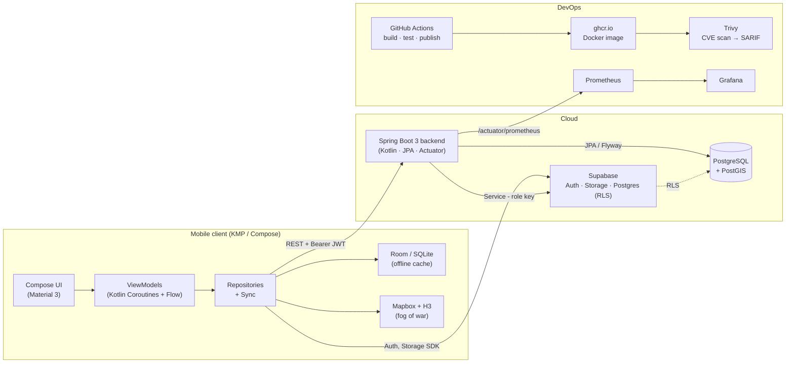
```mermaid
flowchart LR
    subgraph Client["Mobile client (KMP / Compose)"]
        UI["Compose UI<br/>(Material 3)"]
        VM["ViewModels<br/>(Kotlin Coroutines + Flow)"]
        Repo["Repositories<br/>+ Sync"]
        Room["Room / SQLite<br/>(offline cache)"]
        Map["Mapbox + H3<br/>(fog of war)"]
        UI --> VM --> Repo --> Room
        Repo --> Map
    end

    subgraph Cloud["Cloud"]
        direction TB
        Supabase["Supabase<br/>Auth · Storage · Postgres (RLS)"]
        Backend["Spring Boot 3 backend<br/>(Kotlin · JPA · Actuator)"]
        Postgres[("PostgreSQL<br/>+ PostGIS")]
        Backend -->|JPA / Flyway| Postgres
        Supabase -.->|RLS| Postgres
    end

    subgraph DevOps["DevOps"]
        GHA["GitHub Actions<br/>build · test · publish"]
        GHCR["ghcr.io<br/>Docker image"]
        Trivy["Trivy<br/>CVE scan → SARIF"]
        Prom["Prometheus"]
        Graf["Grafana"]
        GHA --> GHCR --> Trivy
        Backend -->|/actuator/prometheus| Prom --> Graf
    end

    Repo -->|REST + Bearer JWT| Backend
    Repo -->|Auth, Storage SDK| Supabase
    Backend -->|Service - role key| Supabase
```

**Why this shape?**

- **Client-heavy**: gameplay (fog reveal, POI proximity checks) runs locally in real
  time, so latency and connectivity don't ruin the experience.
- **Monolithic backend**: a single Spring Boot service is enough at this scale and
  keeps transactions (e.g. *discover POI → grant achievement → update points*) in one
  place. Microservices would add operational cost without payoff.
- **Supabase as a platform**: outsources auth, file storage, and row-level security
  to a managed service, while the custom Spring backend handles domain logic the
  platform can't (achievement engine, ranking aggregations, fog of war hex
  bookkeeping, custom POIs).

### Domain model (ERD)

<p align="center">
  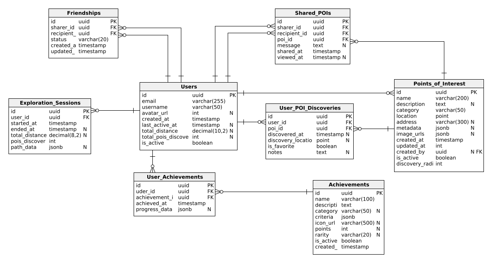
</p>

### Use cases

A high-level use-case overview is at
[`docs/diagrams/use_case_diagram.png`](docs/diagrams/use_case_diagram.png), with
per-domain diagrams for [account](docs/diagrams/usecase_account.png),
[exploration](docs/diagrams/usecase_exploration.png),
[gamification](docs/diagrams/usecase_gamification.png),
[social](docs/diagrams/usecase_social.png), and
[admin](docs/diagrams/usecase_admin.png) flows.

### Backend package layout

The backend is structured by **feature package**, each feature owning its own
`entity`, `dto`, `repository`, `service`, and `controller`. Cross-cutting concerns
(JWT, exceptions, common utilities) live in `shared/`.

```text
org.cityxplore.backend
├── achievements/        achievement engine (definitions + grants)
├── discoveries/         POI discoveries per user
├── fogofwar/            hex-based fog state, generators (e.g. WarsawHexagonGenerator)
├── poi/                 POI catalog (admin + map data)
├── social/
│   ├── friendship/      invites, blocks, friend list
│   ├── rankings/        leaderboard aggregation
│   └── shared/          shared POIs (catalog or custom)
├── user/                profile, sync with Supabase Auth
├── system/              /ping, /environment, actuator wiring
├── config/              Spring configuration
└── shared/              JWT, security, exceptions, storage, common DTOs
```

### Mobile client layout (Kotlin Multiplatform)

```text
app.cityxplore (commonMain)
├── auth/          login, register, Google sign-in, email verify
├── map/           Mapbox + H3 fog of war, POI rendering
├── journal/       discovery log
├── achievements/  list + detail
├── social/        friends, shared POIs, rankings
├── profile/       own + other profile, avatar
├── core/          location, connectivity, sync, cache, image picker
├── database/      Room entities + DAOs + migrations
├── di/            Koin modules (one per feature)
├── platform/      expect/actual: BackHandler, DeepLinks, base ViewModel
└── theme/         Material 3 theming
```

The same module compiles to **`androidTarget`**, **`iosX64`**, **`iosArm64`** and
**`iosSimulatorArm64`** via Compose Multiplatform; only platform-specific glue
(Mapbox bindings, Google credentials, location services) lives in `androidMain` /
`iosMain`.

---

## Engineering highlights

These are the bits a reviewer (developer / DevOps / architect) tends to actually care
about. Each item links to the file it lives in.

### Mobile / KMP

- **One codebase, two platforms.** UI, navigation, repositories, ViewModels, DB and
  business logic are 100% shared via Compose Multiplatform; platform code is limited
  to map SDK, location services, and credential providers.
- **Hex-based fog of war using H3.** Geospatial state is stored as H3 cell IDs
  (`uber/h3`), making proximity checks and rendering trivial without expensive
  polygon math. See `client/.../map/` and the backend `fogofwar/` package.
- **Offline-first sync.** Room is the source of truth on device; `core/sync/` and
  `core/connectivity/` reconcile with the backend when online. The app remains fully
  usable with no signal — fog state, POI list, and journal all work offline.
- **Type-safe build configuration.** Secrets and tokens (Mapbox, Google, Supabase
  URL/key) are injected via `gmazzo.buildconfig` from `local.properties` **or** env
  vars (CI), with a hard failure if missing. See
  [`client/composeApp/build.gradle.kts`](client/composeApp/build.gradle.kts).

### Backend

- **Clean / package-by-feature architecture.** Controllers never expose JPA
  entities; every public API uses DTOs (`<Feature>Dto`, `Create<Feature>Dto`,
  `Update<Feature>Dto`). Services are `@Transactional`, repositories are Spring Data.
- **Spatial-aware Postgres.** PostGIS + Hibernate Spatial for any geospatial data
  that doesn't fit H3 (radius queries, custom POI placement).
- **Defense in depth on auth.**
    - JWT (HS256) verified locally by `NimbusJwtDecoder` against the Supabase secret,
      with audience and issuer pinned.
    - Spring Security + role-based guards on `/api/admin/**`.
    - Postgres **Row Level Security** policies as the last line of defense
      (`auth.uid() = user_id`), so even a compromised service key can't read another
      user's rows.
- **Idiomatic Kotlin + Spring.** `data class` DTOs, immutable where possible,
  `@AllOpen` / `noArg` plugins keep JPA happy without manual boilerplate.

### DevOps

- **GitHub Actions pipeline with four stages** (see
  [`.github/workflows/ci.yml`](.github/workflows/ci.yml)):
    1. **`build`** — runs on every push & PR, spins up a real PostgreSQL service
       container, runs `:backend:check` (compile + unit + integration tests).
    2. **`client`** — builds a **signed release APK** on Linux runners using a
       keystore decoded from base64-encoded GitHub Secrets at runtime; uploads the
       APK as a 30-day artifact on `main`.
    3. **`publish`** — only on `main`: builds a multi-stage Docker image and pushes
       to **GitHub Container Registry** with both `latest` and `sha-<short>` tags.
    4. **`scan`** — runs **Trivy** against the freshly published image, emits SARIF,
       uploads to **GitHub Code Scanning** (Security tab).
- **Multi-stage Dockerfile.** Stage 1 (`temurin:21-jdk-jammy`) compiles; stage 2
  (`temurin:21-jre-jammy`) just runs. Smaller image, smaller attack surface.
- **Reproducible local dev stack.** `backend/docker/docker-compose.yml` brings up
  Postgres+PostGIS, Prometheus, and Grafana with pre-provisioned datasource — one
  command and you have a working environment.
- **Keystore safety.** The `.jks` is `.gitignore`'d, stored as a base64 GitHub
  Secret, decoded only at runtime in CI, never persisted.

A deeper write-up (in Polish) of the DevOps stack — pipeline, Prometheus, Grafana,
Trivy, with PromQL examples — lives at [`docs/DEVOPS_GUIDE.md`](docs/DEVOPS_GUIDE.md).

---

## Repository structure

```text
cityxplore/
├── backend/              Spring Boot 3 / Kotlin backend
│   ├── docker/           Dockerfile, docker-compose, Prometheus & Grafana provisioning
│   ├── src/main/kotlin/  feature packages (achievements, poi, social, fogofwar, ...)
│   ├── src/main/resources/db/migration/   Flyway SQL migrations
│   └── README_DEV.md     backend developer guide
├── client/               Kotlin Multiplatform mobile client
│   └── composeApp/       Compose Multiplatform app (androidMain, iosMain, commonMain)
├── supabase/             Supabase config + migrations + edge functions
├── docs/                 README assets, DevOps guide, diagrams, screenshots, videos
├── tools/                seed scripts (e.g. `achievements_seeder.sql`)
├── .github/workflows/    CI/CD pipeline definitions
├── settings.gradle.kts   Gradle multi-project setup (backend + client)
└── LICENSE
```

---

## Getting started

### Prerequisites

- **JDK 21** (Temurin recommended)
- **Docker** (for the local Postgres + Prometheus + Grafana stack)
- **Android Studio** *or* **Xcode** (for the mobile client)
- A **Supabase** project (free tier is enough) for Auth + Storage
- API keys: **Mapbox public token**, **Google Maps key**, **Google OAuth Web Client ID**

### 1. Backend (local)

```bash
# Bring up Postgres + PostGIS + Prometheus + Grafana
cd backend/docker
docker compose up -d
cd ../..

# Configure secrets in backend/.env (see backend/README_DEV.md §9 for the full list)
cp backend/.env.example backend/.env   # then fill in the values

# Run the API on http://localhost:8080
./gradlew :backend:bootRun --args='--spring.profiles.active=dev'
```

The API exposes:

- `http://localhost:8080/api/public/ping` — sanity check
- `http://localhost:8080/swagger-ui.html` — interactive API docs (Springdoc)
- `http://localhost:8080/actuator/prometheus` — metrics scrape endpoint

Local stack UIs:

- Grafana: http://localhost:3000 (`admin` / `admin`)
- Prometheus: http://localhost:9090

### 2. Mobile client

Add the following to `local.properties` at the repo root:

```properties
SUPABASE_URL=https://<your-project>.supabase.co
SUPABASE_KEY=<your-anon-key>
MAPBOX_PUBLIC_TOKEN=pk.<your-mapbox-token>
GOOGLE_MAPS_KEY=<your-google-maps-key>
GOOGLE_WEB_CLIENT_ID=<your-google-oauth-web-client-id>.apps.googleusercontent.com
```

**Android:**

```bash
./gradlew :client:composeApp:assembleDebug
# or run via Android Studio with the composeApp run configuration
```

**iOS:**

Open `client/iosApp` in Xcode and run.

### 3. Backend in a container

```bash
docker pull ghcr.io/szafranee/cityxplore/backend:latest
docker run --rm -p 8080:8080 --env-file backend/.env \
  ghcr.io/szafranee/cityxplore/backend:latest
```

---

## CI/CD pipeline

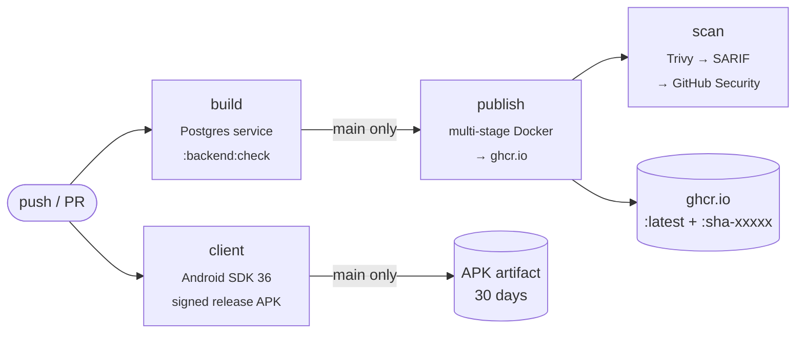
```mermaid
flowchart LR
    A([push / PR]) --> B[build<br/><sub>Postgres service<br/>:backend:check</sub>]
    A --> C[client<br/><sub>Android SDK 36<br/>signed release APK</sub>]
    B -- main only --> D[publish<br/><sub>multi-stage Docker<br/>→ ghcr.io</sub>]
D --> E[scan<br/><sub>Trivy → SARIF<br/>→ GitHub Security</sub>]
C -- main only --> F[(APK artifact<br/>30 days)]
D --> G[(ghcr.io<br/>:latest + :sha-xxxxx)]
```

| Job       | Trigger         | What it does                                                                                     |
|-----------|-----------------|--------------------------------------------------------------------------------------------------|
| `build`   | every push / PR | JDK 21, real Postgres service container, `./gradlew :backend:check`                              |
| `client`  | every push / PR | Android SDK 36, decodes keystore, builds **signed release APK**, uploads as artifact (main only) |
| `publish` | push to `main`  | builds multi-stage Docker image, pushes to `ghcr.io` with `latest` + `sha-<short>` tags          |
| `scan`    | after `publish` | Trivy scans the image for HIGH/CRITICAL CVEs, uploads SARIF to GitHub Code Scanning              |

See [`.github/workflows/ci.yml`](.github/workflows/ci.yml) for the source.

---

## Database & migrations

Two complementary migration tracks, intentionally separated:

- **Flyway** — drives the **application schema** owned by the backend (entities,
  indexes, FK constraints). Lives in
  [`backend/src/main/resources/db/migration/`](backend/src/main/resources/) and runs
  automatically on Spring Boot startup.
- **Supabase CLI migrations** — drive **auth-adjacent schema and Row Level Security
  policies** that need to live next to `auth.users` in Supabase. Lives in
  [`supabase/migrations/`](supabase/migrations/).

This split keeps domain schema changes reviewable in the backend repo while RLS and
auth-bound objects stay where Supabase expects them.

---

## Observability

The backend ships with a working metrics stack out of the box.

- **Spring Boot Actuator** exposes `/actuator/health`, `/actuator/info`,
  `/actuator/metrics`, and `/actuator/prometheus`.
- **Micrometer** translates JVM, HikariCP, HTTP and JPA internals into Prometheus
  format.
- **Prometheus** scrapes the backend every 15s
  ([`backend/docker/prometheus.yml`](backend/docker/prometheus.yml)).
- **Grafana** auto-loads a Prometheus datasource on startup
  ([`backend/docker/grafana/provisioning/`](backend/docker/grafana/provisioning/));
  the dashboard tracks JVM heap, HTTP request rate, and active DB connections.

A walkthrough with PromQL examples is in [`docs/DEVOPS_GUIDE.md`](docs/DEVOPS_GUIDE.md).

---

## Security

| Layer        | Mechanism                                                                                                                                                                                                       |
|--------------|-----------------------------------------------------------------------------------------------------------------------------------------------------------------------------------------------------------------|
| Transport    | HTTPS in production (Railway-managed)                                                                                                                                                                           |
| API          | JWT HS256 verified locally; `Authorization: Bearer …` required on all `/api/**` except `/api/public/**`                                                                                                         |
| Spring       | `SecurityConfig` + role-based access on `/api/admin/**`                                                                                                                                                         |
| Database     | Postgres **Row Level Security** policies (`auth.uid() = user_id`) — defense in depth even if a key leaks                                                                                                        |
| Supply chain | **Trivy** scans the published Docker image for HIGH / CRITICAL CVEs every push to `main`; results visible under repo *Security → Code scanning*                                                                 |
| Secrets      | Backend secrets in environment / `.env` (gitignored); mobile secrets in `local.properties` (gitignored); CI secrets in GitHub Secrets; release keystore stored as base64 GitHub Secret, decoded only at runtime |

---

## Testing

- **Backend unit + integration tests** with Spring Boot Test, MockK / SpringMockK,
  spring-security-test (`mockJwt()` for stubbing authenticated calls). Integration
  tests run against a **real PostgreSQL** service container in CI — not mocks —
  to catch migration and SQL-level regressions early.
- **Client** unit tests with `kotlin-test`, Coroutines test utilities, **Turbine** for
  Flow assertions, and **MockK** for dependencies.

Run everything:

```bash
./gradlew check
```

---

## Screenshots

> All screenshots are taken from the actual application running on Android.

### Authentication

| Login                                | Register                                   | Verify email                                       |
|--------------------------------------|--------------------------------------------|----------------------------------------------------|
| 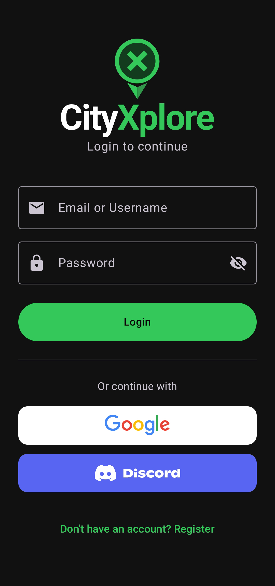 |  | 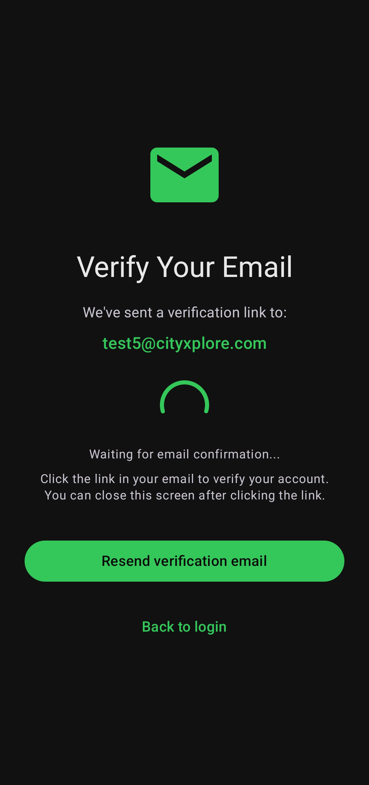 |

| Create profile                                         | Update avatar                                        |
|--------------------------------------------------------|------------------------------------------------------|
| 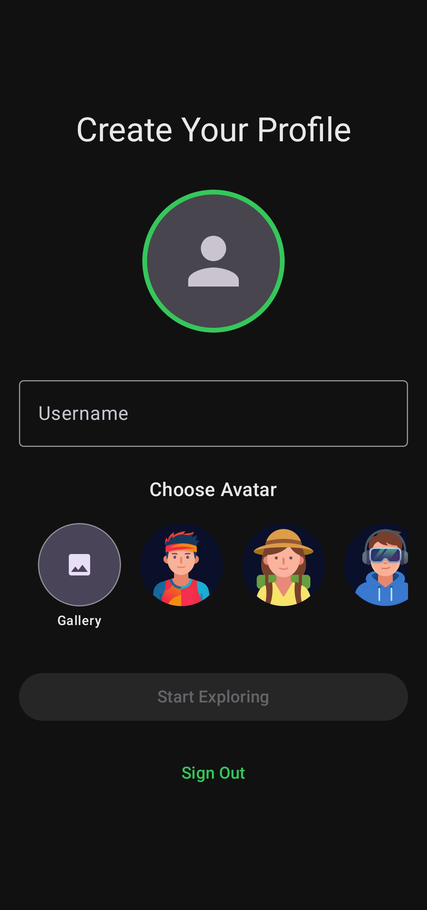 | 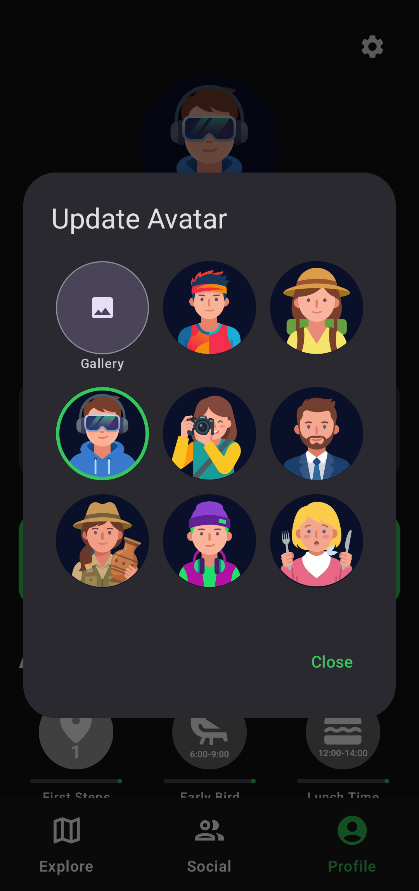 |

### Map & exploration

| Map (fog of war)                 | Pick location                                        |
|----------------------------------|------------------------------------------------------|
| 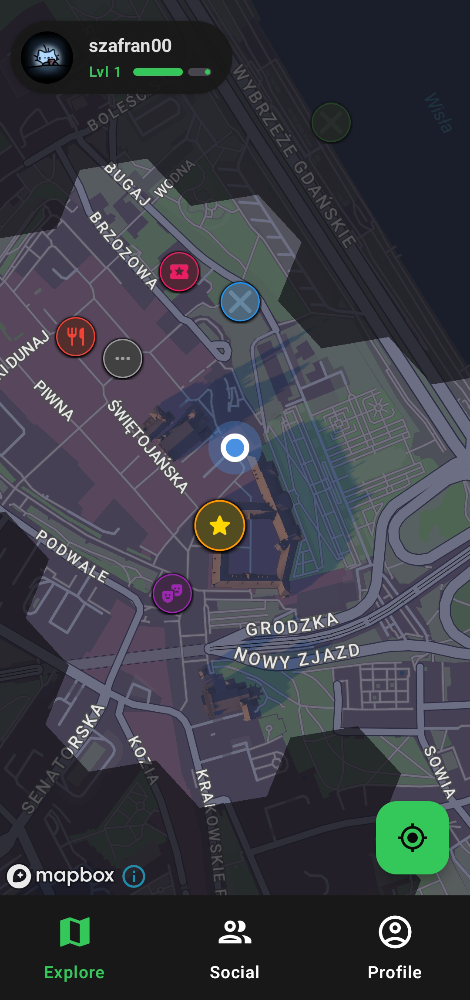 | 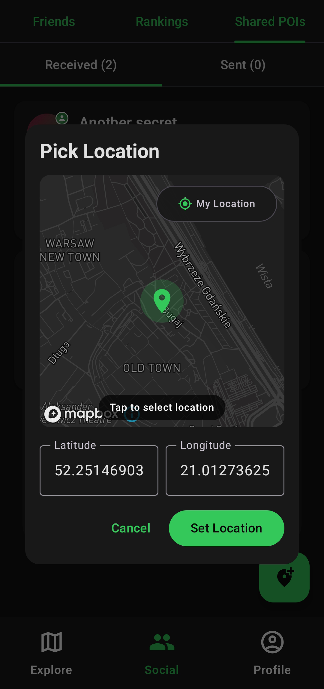 |

| Undiscovered POI                                                   | New discovery                                        | POI details                                      |
|--------------------------------------------------------------------|------------------------------------------------------|--------------------------------------------------|
| 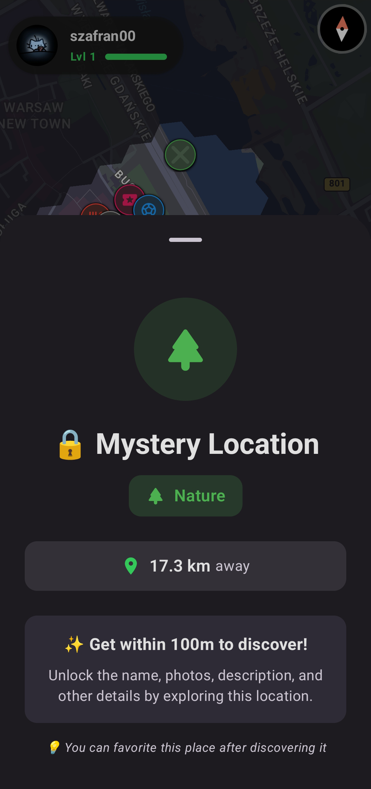 | 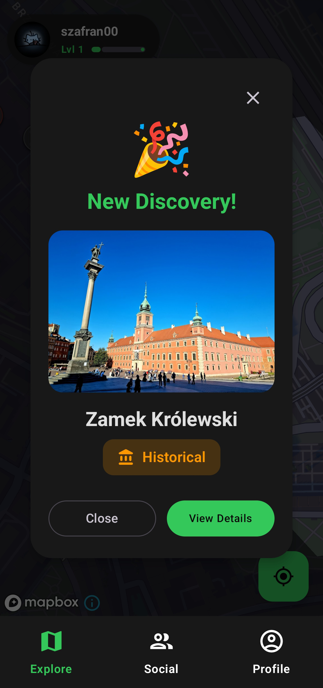 | 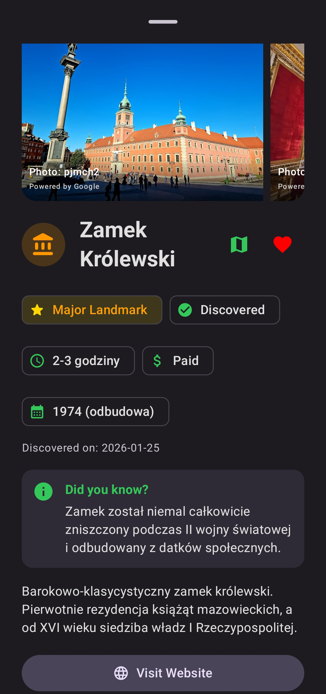 |

| Create POI                                     | Location photo                                         |
|------------------------------------------------|--------------------------------------------------------|
| 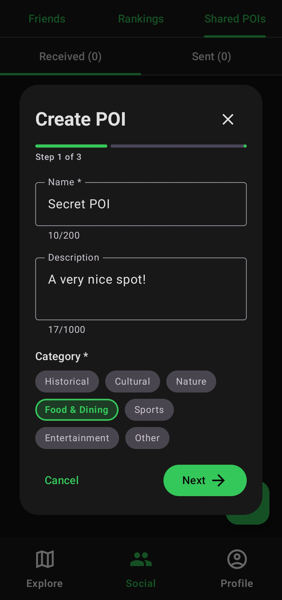 | 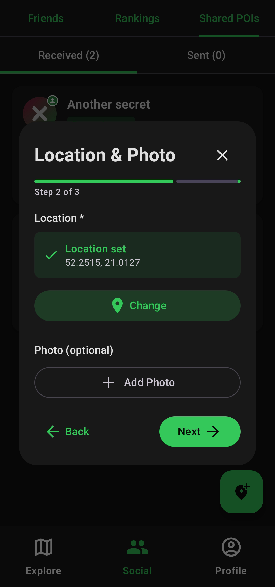 |

### Profile, journal, achievements

| Profile                                      | Profile (cont.)                              | Other user's profile                                 |
|----------------------------------------------|----------------------------------------------|------------------------------------------------------|
| 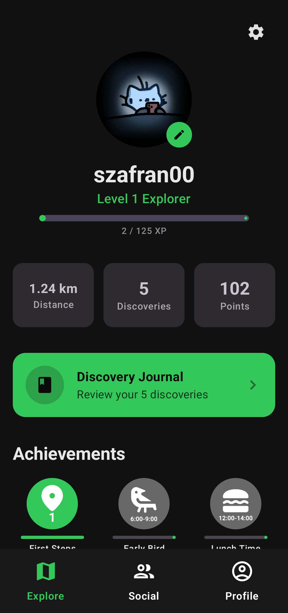 | 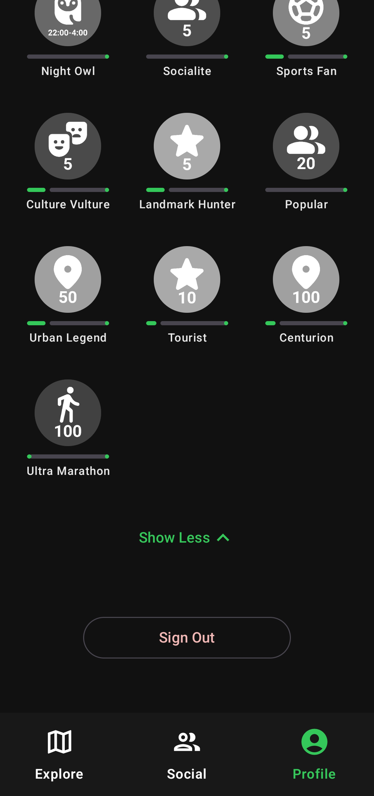 | 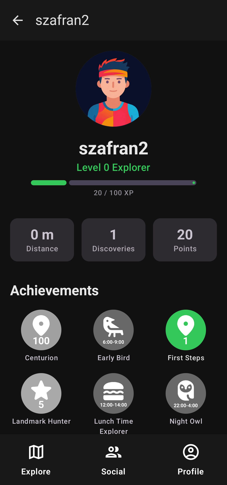 |

| Journal                                  | Achievement details                                              | Global ranking                                         |
|------------------------------------------|------------------------------------------------------------------|--------------------------------------------------------|
| 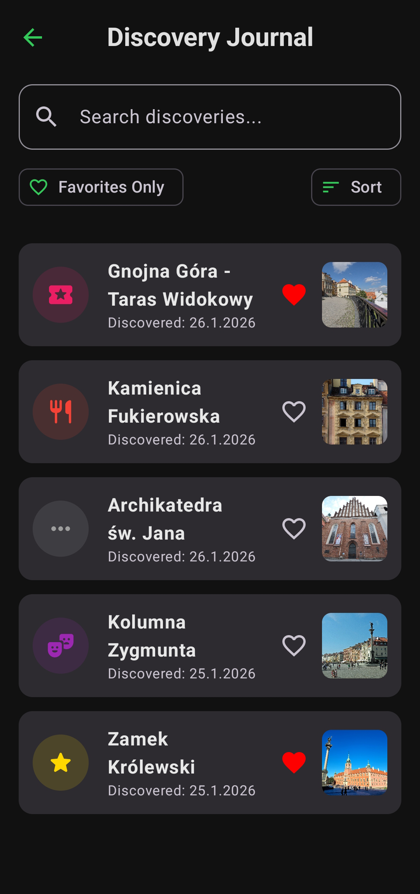 | 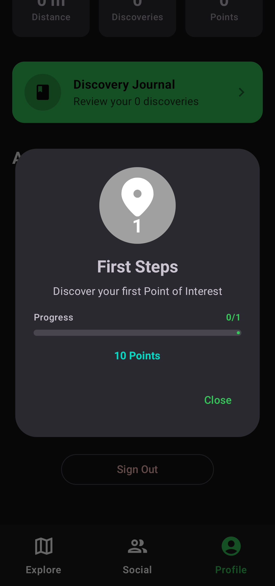 |  |

### Social

| Friends                                  | Share with…                                    | Shared POI details                                             |
|------------------------------------------|------------------------------------------------|----------------------------------------------------------------|
| 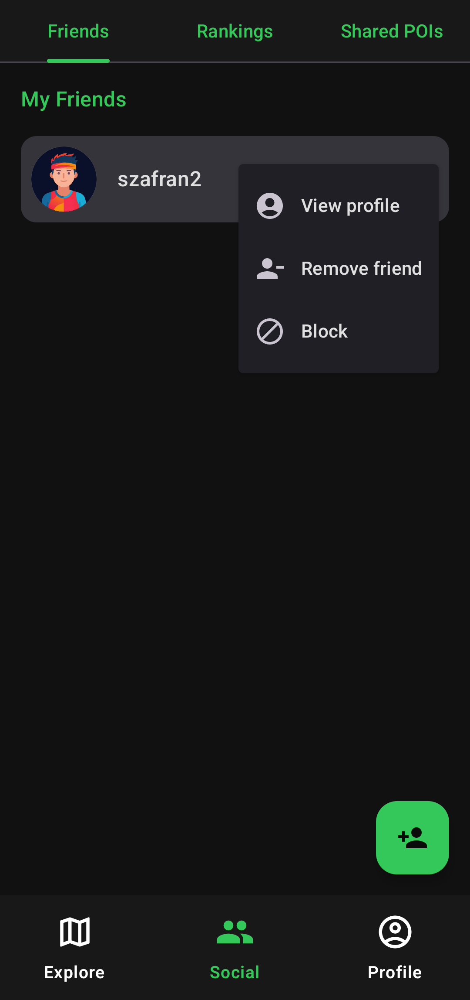 | 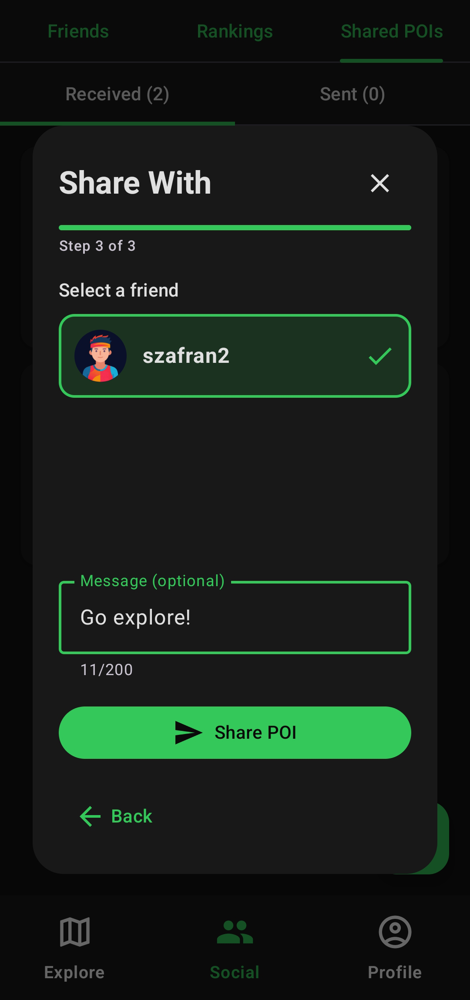 |  |

| Sent POIs                                    | Received POIs                                        |
|----------------------------------------------|------------------------------------------------------|
| 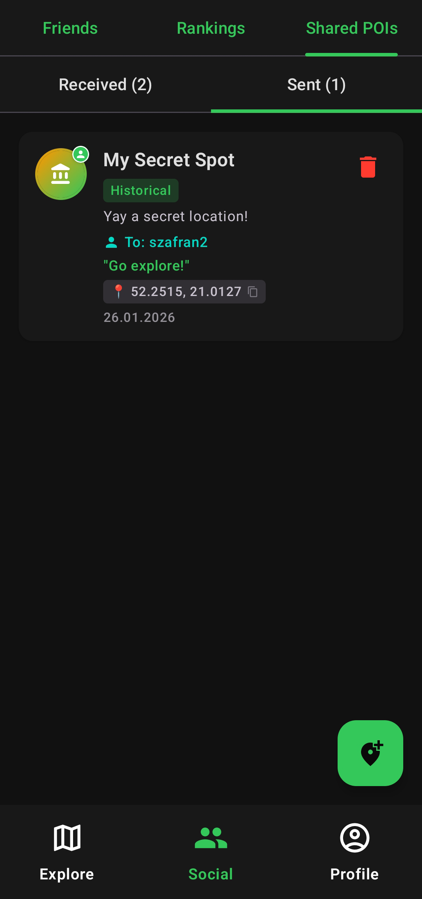 | 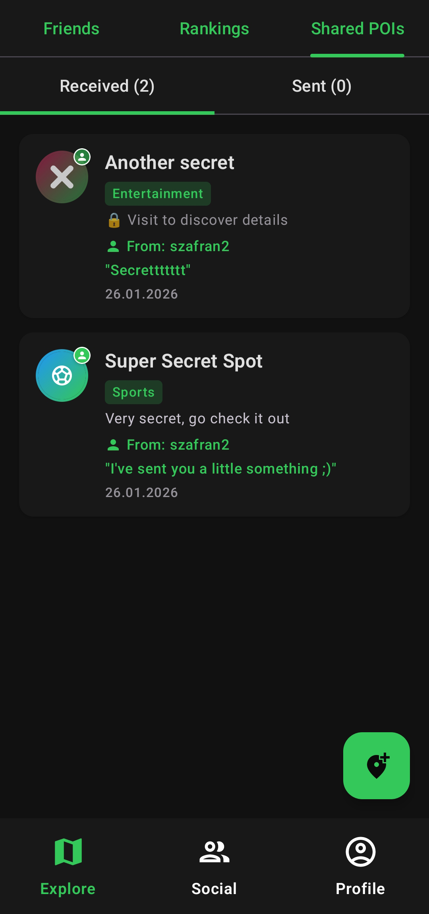 |

---

## Project status

- **Backend currently paused** to avoid hosting costs (was previously deployed on
  Railway with Supabase as managed Postgres + Auth + Storage). The full stack is
  reproducible locally — see [Getting started](#getting-started).
- The repository is maintained as a **portfolio / showcase project**; PRs and issues
  are welcome but no roadmap is committed.

---

## License

Released under the **MIT License** — see [`LICENSE`](LICENSE).

Third-party assets (Mapbox tiles, Google Maps, Wikipedia / MediaWiki content,
Google Places content) are subject to their respective providers' Terms of Service.

---

## Author

**Kacper Szafrański** — [@Szafranee](https://github.com/Szafranee)

Built as my Engineering Thesis at the **Polish-Japanese Academy of Information
Technology (PJAIT)**, 2025–2026.
